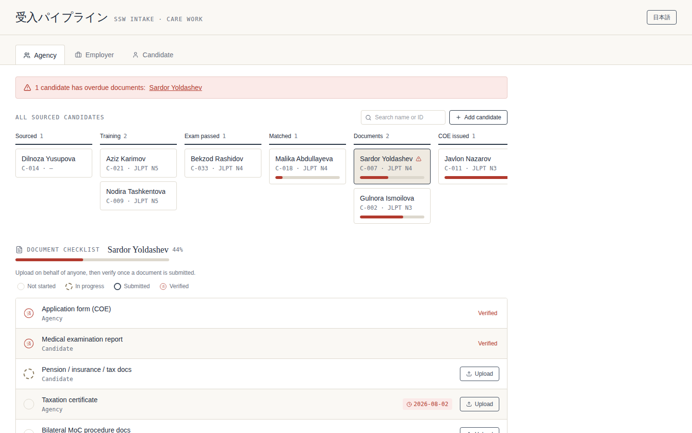

# UzuLink Work

**B2B SaaS for the Uzbekistan → Japan Specified Skilled Worker labor corridor.**
Tracks a candidate from *sourced* to *deployed* — candidate matching,
pre-departure training verification, and visa/employment document workflow —
in one system instead of spreadsheets, email, and LINE/Telegram chats.


<p align="center">
  
</p>

---

## Why this exists

Japan signed its SSW Memorandum of Cooperation with Uzbekistan in December 2019.
The corridor is real and actively being scaled — a 2025 Uzbekistan-backed program
aims to train and send 10,000 specialists to Japan over five years — but almost
no dedicated software exists for it yet. Larger platforms are focused on
Vietnam, Indonesia, the Philippines, and Myanmar.

Japanese SMEs in labor-shortage sectors (care work, construction, manufacturing,
food service) currently manage the entire hiring pipeline — sourcing, training
verification, and the visa/COE document chain — by hand, through an
intermediary, with no shared system of record. Missing documents cause weeks
of delay; the quality of intermediaries is inconsistent enough that it's the
documented reason the Japan–Uzbekistan MOC exists in the first place.

UzuLink Work is a narrow, corridor-specific bet: build the compliance-first
workflow tool this specific pipeline needs, starting with one sector (care
work), before larger, generic platforms turn their attention here.

## What it does

| Module | What it covers |
|---|---|
| **A — Candidate matching** | Filterable candidate list (sector, exam level, location) and employer job postings. A visible pipeline status per candidate: `Sourced → Training → Exam passed → Matched → Documents in progress → COE issued → Deployed`. Deliberately not an algorithmic black box. |
| **B — Training tracking** | Training centers log Japanese-language milestones (JLPT/JFT-Basic), vocational test results, and cultural-orientation completion. Employers get a read-only view before they commit to hiring. |
| **C — Document workflow** | A configurable checklist per sector (COE application, medical exam, pension/tax/insurance docs, MOC-required documents, employment contract, support plan), with an owner and deadline per document, and a verification step. |
| **D — Dashboard & communication** | One dashboard per employer — every candidate, where each is stuck, what's needed next. Bilingual (Japanese/Uzbek, Russian as a stretch) labels, and a per-candidate notes thread instead of ad hoc chat. |

**Explicitly out of scope for v1:** payments/escrow, placement-fee billing,
algorithmic matching, SSW-2/family-visa case management, Ikusei Shuro-specific
flows (that system doesn't launch until April 2027), and any second country
or sector. Corridor depth over breadth.

## Current status

This repo currently contains the **frontend prototype** — a working,
interactive mock of Modules A, C, and part of D, with three role-based views
(agency, employer, candidate) and no backend wired up yet. Candidate data and
document status live in local component state.

| Phase | Status |
|---|---|
| Discovery (SME/agency interviews, sector lock) | — |
| Frontend prototype (Modules A, C, D-lite) | ✅ done |
| Backend (FastAPI + PostgreSQL, Modules A–C) | 🚧 in progress |
| Pilot onboarding (1–2 real employers, 1 training partner) | planned |
| i18n (JA/UZ/RU) | planned |

## Tech stack

- **Backend:** FastAPI (Python), PostgreSQL, role-based auth (employer / agency / candidate / admin)
- **File storage:** S3-compatible, LocalStack for local dev
- **Frontend:** React + Tailwind
- **Testing:** Playwright, focused on the document workflow specifically — a missed status update here has real visa consequences
- **Localization:** Japanese / Uzbek / Russian string tables

## Getting started (frontend prototype)

```bash
git clone <this-repo>
cd uzulink-work
npm install
npm run dev
```

Open the local dev URL and switch between the Agency, Employer, and Candidate
tabs to see the three role-based views. Backend setup instructions will land
here once Modules A–C are wired up.

## Project structure

```
uzulink-work/
├── backend/     # FastAPI app — models, routers, services (see PRD data model)
├── frontend/    # React dashboard — role-based views, document checklist
├── infra/       # docker-compose, LocalStack, Dockerfiles
└── docs/        # PRD, data model, sector checklist reference
```

See [`docs/PRD.md`](./docs/PRD.md) for the full product spec and 6-month roadmap.

## Roadmap (6-month bootcamp window)

| Metric | Target |
|---|---|
| Pilot SME or agency customers | 2–3 |
| Candidates tracked end-to-end | 15–30 |
| Sector checklist fully built | 1 (care work) |
| Signed pilot agreement (agency or training center) | 1 |

## License

TBD.

## Author

Dilyora
